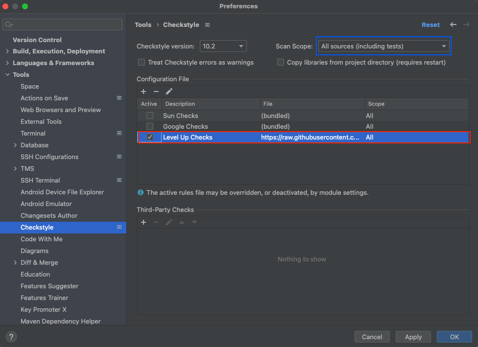

# How to install code styles tools

# Instructions
* [RU](#ru)
* [EN](#en)

# RU
* [Настройка Checkstyle для IntelliJ IDEA](#настройка-checkstyle-для-intellij-idea)
* [Настройка Code Style для IntelliJ IDEA](#настройка-code-style-для-intellij-idea)

## Настройка Checkstyle для IntelliJ IDEA
Используйте конфигурационный файл: https://raw.githubusercontent.com/khda91/leveup-code-checkers-configurations/main/checkstyle/checkstyle.xml.
Настройки для pom.xml файла можно взять из [pom.xml](pom.xml) данного репозитория.

Для IntelliJ IDEA используйте следующий плагин: https://plugins.jetbrains.com/plugin/1065-checkstyle-idea


Вставьте упомянутый URL: https://raw.githubusercontent.com/khda91/leveup-code-checkers-configurations/main/checkstyle/checkstyle.xml


Выберете импортированую конфигурацию



Запускайте проверки


```bash
mvn clean validate
```

## Настройка Code Style для IntelliJ IDEA

Скопируйте содержимое файла https://raw.githubusercontent.com/khda91/leveup-code-checkers-configurations/main/formatter/.editorconfig в корневую директорию вашего проекта

Файл должен называться `.editorconfig`


В настройках IntelliJ IDEA `Preferences -> Editor -> Code Style` секции, проверьте что `Enable EditorConfig support` выбрана


# EN
## Table of content
* [Configuration Checkstyle for IntelliJ IDEA](#configuration-checkstyle-for-intellij-idea)
* [Configuration Code Style for IntelliJ IDEA](#configuration-code-style-for-intellij-idea)

## Configuration Checkstyle for IntelliJ IDEA
Use the following config: https://raw.githubusercontent.com/khda91/leveup-code-checkers-configurations/main/checkstyle/checkstyle.xml.
Settings for pom.xml can be taken from this repo [pom.xml](pom.xml)

In IntelliJ IDEA use the following plugin: https://plugins.jetbrains.com/plugin/1065-checkstyle-idea


Paste mentioned URL: https://raw.githubusercontent.com/khda91/leveup-code-checkers-configurations/main/checkstyle/checkstyle.xml


Check imported Configuration file


Sometimes run checks


```bash
mvn clean validate
```

## Configuration Code Style for IntelliJ IDEA

Copy content of the file https://raw.githubusercontent.com/khda91/leveup-code-checkers-configurations/main/formatter/.editorconfig root directory of your to your project.

File must have name `.editorconfig`


In the `Preferences -> Editor -> Code Style` section check that `Enable EditorConfig support` option is checked


